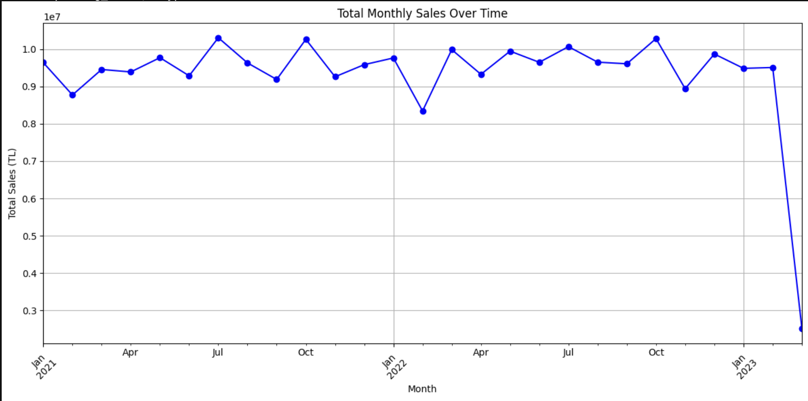
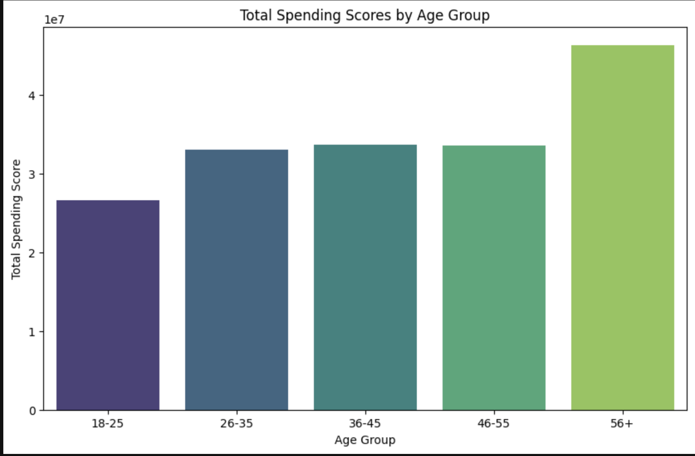
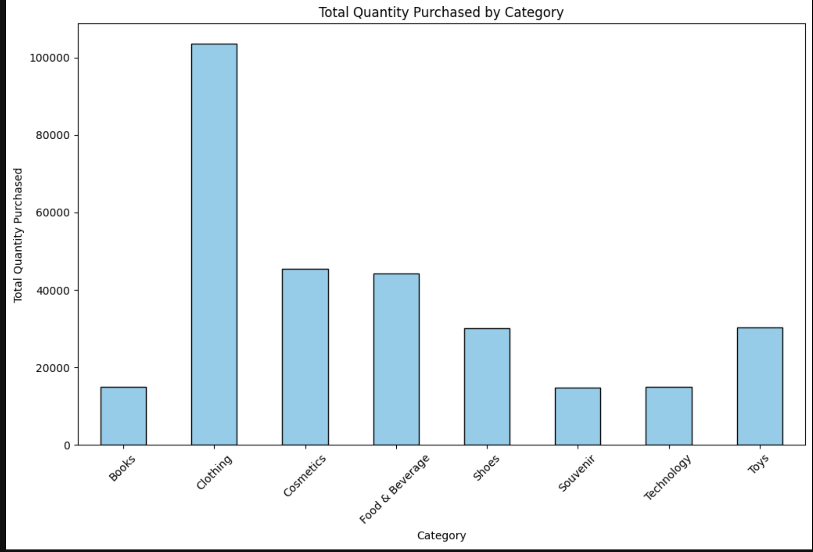
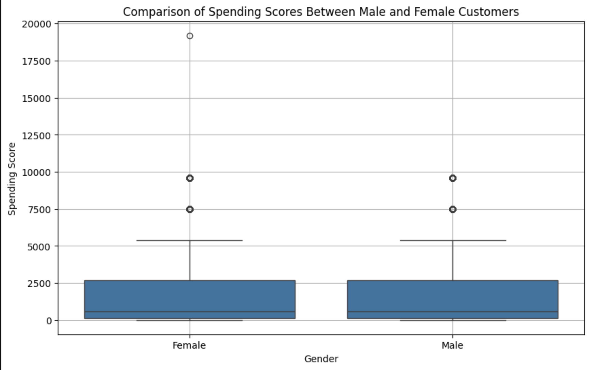

# Dibs Retail Analysis

## Overview

This project explores customer purchasing behaviour and retail sales trends using Python-based business analytics techniques. The analysis was conducted on a retail transaction dataset containing over 99,000 customer purchase records across multiple shopping malls and product categories.

The project focuses on transforming raw retail data into actionable business insights through:

- Data cleaning and preprocessing
- Exploratory data analysis (EDA)
- Feature engineering
- Customer segmentation
- Sales trend analysis
- Business intelligence reporting
- Visual storytelling

The workflow demonstrates an end-to-end retail analytics pipeline commonly used in real-world business analytics projects.

---

## Dataset Summary

The dataset contains transactional retail information including:

- Customer demographics
- Product categories
- Quantity purchased
- Payment methods
- Shopping mall locations
- Invoice dates
- Product pricing

### Dataset Size

- Rows: 99,461
- Columns: 10

> Note: The original dataset is excluded from this repository for privacy and distribution considerations.

---

## Business Objectives

This project aims to answer several key retail business questions:

- Which product categories generate the highest sales?
- Which customer age groups contribute most to revenue?
- What payment methods are most preferred?
- Which shopping malls attract the highest customer activity?
- How do customer purchasing behaviours vary across demographics?
- What sales trends exist over time?

---

## Project Workflow

### 1. Data Cleaning & Preprocessing

The project includes extensive preprocessing and data quality handling:

- Missing value treatment
- Incorrect category correction
- Date conversion and formatting
- Data type optimisation
- Duplicate validation
- Outlier detection and handling
- Skewness reduction using Box-Cox transformation

### 2. Exploratory Data Analysis (EDA)

Exploratory analysis was performed to identify:

- Customer demographic distributions
- Product category trends
- Shopping mall activity
- Quantity and price distributions
- Payment method preferences
- Sales behaviour patterns

### 3. Feature Engineering

Additional analytical features were created including:

- Spending score
- Age segmentation groups
- Monthly sales aggregation
- Time-based variables (year, month, date)

### 4. Business Analytics & Insights

The project generated business-focused insights regarding:

- High-performing product categories
- Revenue contribution by age group
- Customer spending behaviour
- Payment preference analysis
- Monthly sales trends
- Strategic retail recommendations

---

## Key Insights

### Product Category Performance

- Clothing generated the highest sales volume across all categories.
- Books, souvenirs, and technology products showed comparatively lower sales activity.

### Customer Spending Behaviour

- Customers aged 56+ contributed the highest overall spending.
- Male and female customers showed similar median spending behaviour.

### Payment Method Analysis

- Cash was the most frequently used payment method.
- Debit cards showed the lowest transaction share.

### Time Series Trends

- Monthly sales remained relatively stable across 2021–2022.
- Seasonal peaks appeared during mid-year and end-of-year periods.
- A noticeable sales drop occurred in March 2023, indicating potential business or operational changes.

---

## Key Visualisations

### Monthly Sales Trend

This visual highlights overall retail sales performance over time and reveals seasonal sales behaviour, stable monthly revenue patterns, and a noticeable drop in the final month due to incomplete transactional data.



---

### Spending by Age Group

This analysis shows that customers aged 56+ contributed the highest overall spending, indicating a strong high-value customer segment within the retail business.



---

### Product Category Demand Distribution

This visual demonstrates purchasing behaviour across product categories, with Clothing significantly outperforming other categories in total purchase volume.



---

### Customer Payment Method Distribution

This chart highlights customer payment preferences, showing Cash as the dominant payment method followed by Credit Card transactions.


---

### Customer Spending Distribution by Gender

The boxplot compares spending distributions between male and female customers and highlights similar median spending behaviour with several high-spending outliers.



---

## Technologies Used

- Python
- Pandas
- NumPy
- Matplotlib
- Seaborn
- SciPy
- Jupyter Notebook

---

## Repository Structure

```bash
dibs-retail-analysis/
│
├── data/
│   ├── raw/
│   └── processed/
│
├── notebooks/
│   └── DibsRetailAnalysis.ipynb
│
├── reports/
│   └── DibsRetailAnalysis.pdf
│
├── visuals/
│
├── README.md
└── .gitignore